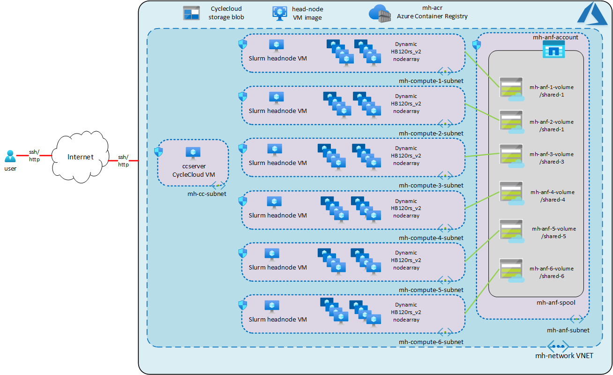
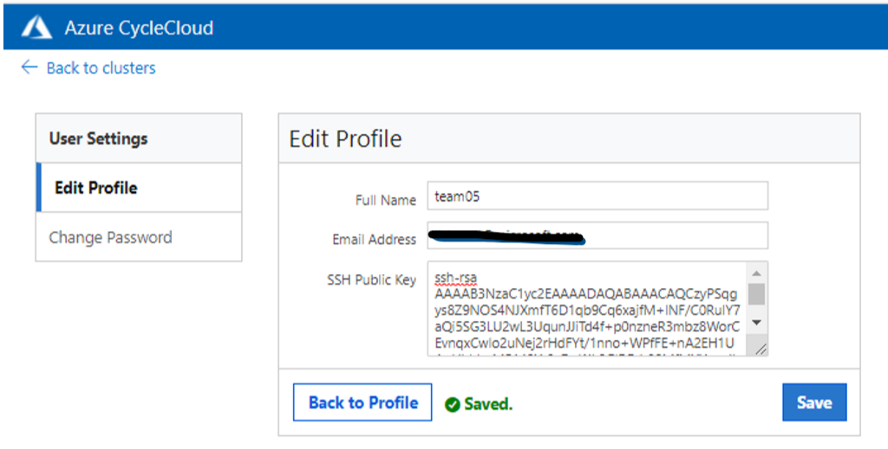

# RTP-microshack
A Github repository for the Azure CycleCloud RTP MicroHack

# Contents
[Scenario](#scenario)

[Objectives](#objectives)

[Pre-Requisites](#pre-requisites)

[Lab](#lab)

[Appendix - Deploying the MicroHack environment](#appendix)

# Scenario
An university department wants to run a set of molecular dynamics simulations as part of a COVID-19 research initiative within a reasonable amount of time. They decide to use the NAMD (Not (just) Another Molecular Dynamics program) software running on a High Performance Computing (HPC) cluster. As they do not have this infrastructure on-premises, they decide to leverage Microsoft Azure Cloud.

# Objectives
This MicroHack is a walkthrough of creating an High Performance Computing (HPC) cluster on Azure and to run a typical HPC workload on it including the visualization of the redults.
The type of HPC workload manager we are going to use in this MicroHack is Slurm (Simple Linux Utility for Resource Management - https://slurm.schedmd.com/cpu_management.html). 

After completing this MicroHack you will:
-	Know how to deploy a Slurm HPC cluster on Azure through Azure CycleCloud
- Run an HPC application on a Slurm HPC cluster

# Pre-Requeisites 
This MicroHack explores the creation of a High Performance Computing (HPC) Cluster on Microsoft Azure, to run the NAMD application leveraging a singularity container and to visualize the results ones the application ran.



The lab start with an pre-deployed Azure base environment including the following components:
- Virtual Network (VNET).
- Subnet to host the Azure CycleCloud server VM.
- One compute subnet per team  a HPC Cluster per team.
- One storage subnet pre team the HPC Cluster nodes to access the Azure NetApp NFS volumes.
- Set of Network Security Groups to limit the internet access to the environment. 
- Azure Blob Storage account to store the Azure CycleCloud project data.
- Azure NetApp Files (ANF) storage account with one capacity pool and a pre-created NFS volume for each of the teams.
- Azure CycleCloud server VM with and attached Azure Active Directory Managed Identity to be authorized to create HPC Cluster. 
- Azure container registry (ACR) to host the NAMD application singularity container.
- NAMD application sngularity container.
- Azure Virtual Machine Image containing the necessary configuration to create a graphical HPC cluster head node.

# Labs
- Task 1: Create a Slurm HPC Cluster
- Task 2: Download the NAMD singularity container and run a namd benchmark using different nmumbers of nodes 
- Task 3: Analice the benchmark´s scalability and visualice the results  

## Task 1: Create a Slurm HPC Cluster

Select one of your Team´s members to share the Desktop and to login into the CycleCloud server. 
Use a browser and fill in the provide URL. You need to allow the non-secure connection.
Once the GUI comes up login with the provided username and password.


Login into the CycleCloud server
Once logged in you can see the CycleCloud graphical user interface, ready to create a new cluster.


To create a Slurm Cluster, please click on the Slurm Icon on the left.


Once the form to create the new cluster pops up, please name the cluster in a way that one can identify your team number (e.g. Slurm-t06).


In the next section of the form, we need to define the region, HPC node VM SKU (e.g. Standard_HB120rs_v2), maximal number of CPU cores (e.g. 960) and the subnet to deploy into. Please use the information provided to you to set the region, HPC VM Type, max HPC Cores and Subnet ID correctly. The Subnet IT corresponds to the number of the team you belong in (e.g. mh-compute-6-subnet). Please leave the other fields as they are.


On the next screen we will decide where the shared storage for the scheduler and the head nodes resides. This will be the location where the user´s home directory and other shared files will be stored. Change the NFS type to “External NFS” and populate the option NFS IP Address with 10.0.1.4 . Leave mount options empty. 
The Shared Export Path need to be put according to the number of your team (e.g. /shared-6). Please leave the other fields as they are.


 
On the Advanced Setting screen, we leave the Slurm Version (20.11.4-1), Job Accounting and Shutdown Policy and Azure Settings as is.


On the Software section, please change the OS image for the Scheduler to the custom image we are going to indicate you. Select custom image and fill in the name of the image. Leave the HPC and HTC OS versions as they are.


In the advance networking section, please make sure that only Public Head Node is selected: 


To move to the next page, please click on Next on the below. Cloud-init is the industry standard multi-distribution method for cross-platform cloud instance initialization. We will use cloud-init to install additional software packages and to disable SElinux. SELinux (Security Enhancement for Linux) is not required for this non-production environment. We also enable the password authetication on the scheduler node for this micro hack but do recommend to only use ssh private keys instead in a production environment in combination with multi-factor-authenticatin.

This is the cloud-init script we are going to  use for the scheduler:

```YAML
#cloud-config
packages:
  - nfs-utils

runcmd:
  - 'setenforce 0'
  - 'sed -i --follow-symlinks "s/SELINUX=enforcing/SELINUX=disabled/g" /etc/selinux/config'
  - 'yum --enablerepo=extras install -y -q epel-release'
  - 'yum install -y htop'
  - 'yum install -y singularity'
  - 'sed -i "/^[^#]*PasswordAuthentication[[:space:]]no/c\PasswordAuthentication yes" /etc/ssh/sshd_config'
  - 'systemctl restart sshd'
```
For the hpc and htc section we use a slightly different version of the script as ssh password authentication does not need to be disabled:

```YAML
#cloud-config
packages:
  - nfs-utils

runcmd:
  - 'setenforce 0'
  - 'sed -i –follow-symlinks "s/SELINUX=enforcing/SELINUX=disabled/g" /etc/selinux/config'
  - 'yum --enablerepo=extras install -y -q epel-release'
  - 'yum install -y htop'
  - 'yum install -y singularity'
```

Please review the configuration with the tutor before you click on Save to save the configuration as some of the inputs cannot be changed easily afterwards.
Once saved please start the cluster by clicking on the Start button. 


Once the scheduler has started without an error we are ready to move to the next task.

## Task 2: Download the NAMD singularity container and run a namd benchmark using different nmumbers of nodes

Once the cluster came up without any issues you can see in the Azure CycleCloud GUI that the status of the scheduler show a green bar and the two node arrays, hpc and htc, show a grey one.


### Configure an ssh key

Create an ssh key on the command line, using one of the supported protocols. In this example, we'll use simple rsa:
```
ssh-keygen -t rsa -b 4096 -C "a custom comment"
```
Follow the prompts to create that key at a known location, e.g `~/.ssh/id_rsa_rtphack_teamX`

Copy the public key to the clipboard, for example by printing it to screen:
```
cat ~/.ssh/id_rsa_rtphack_teamX
```

Navigate to your team's profile in the top right corner of Cycle Cloud, click `Edit Profile`, and paste it into the `SSH Public Key` field. 



Click `Save`.

### Connect to the scheduler node

By clicking on the scheduler line, another box will be displayed below, which contains more information about the scheduler node. 


By clicking on Connect below, a popup window appears that will show you the IP address to connect trough an SSH client to the scheduler node.


Using the IP address and the username we can use out favourite SSH client to connect to the scheduler.

> *Note*: if you used a non-standard ssh key name, make sure that is provided when connecting with ssh, e.g :
    `
    ssh teamX@<scheduler-ip> -i ~/.ssh/id_rsa_rtphack_teamX
    `

Once you are logged into the session you see the Linux command line prompt:

If you have previously logged in, you'll see a line giving details: Last login: Sat Apr 24 10:42:06 2021 from XX.YY.ZZ.MM

```Shell
Last login: Sat Apr 24 10:42:06 2021 from XX.YY.ZZ.MM
[team6@ip-0A000704 ~]$
```
### Download required files and the namd Singularity container

In the next step create a namd directory and switch into it.

```Shell
[team6@ip-0A000704 ~]$ mkdir namd
[team6@ip-0A000704 ~]$ cd namd
```
Download the job submission namd-sjob.sh script.

```Shell
[team6@ip-0A000704 namd]$ wget https://raw.githubusercontent.com/kaneuffe/RTP-microhack/main/scripts/namd-sjob.sh
```
and the download-benchmak.sh script from github.

```Shell
[team6@ip-0A000704 namd]$ wget https://raw.githubusercontent.com/kaneuffe/RTP-microhack/main/scripts/download_benchmarks.sh
```
Once downloaded we execute the download_benchmarks.sh script.

```Shell
[team6@ip-0A000704 namd]$ . ./download_benchmark.sh
```

The script will download the benchmark input files and move it to a folder called namd-benchmarks.

```Shell
[team6@ip-0A000704 namd]$ ls namd-benchmarks/
1400k-atoms  20k-atoms  3000k-atoms  465k-atoms  61k-atoms  namd
```

Now let´s download the already prepared namd singularity container from the Azure Container Registry using the container registry USERNAME and PASSWORD provided to you.

```Shell
[team6@ip-0A000704 namd]$ singularity pull --docker-username USERNAME --docker-password PASSWORD namd-2.14 oras://mhacr21.azurecr.io/namd/namd-2.14.sif:latest
```
### Submit the first Slurm namd job

Once you downloaded the namd container we need to modify the jobs submission script namd-sjobs.sh, modifying the total number of CPU cores, number olf compute nodes and the path to the singularity container. 
Please change line 5, line 6 and line 28 setting the number of nodes to 1, number of ntasks to 120 and the path of the namd container to /shared/home/TEAM_USERNAME/namd/namd-2.14.sif.

```Shell-script
#!/bin/bash
#SBATCH --job-name=namd
#SBATCH --error=%x_%j.err
#SBATCH --output=%x_%j.out
#SBATCH --nodes=1
#SBATCH --ntasks=120
#SBATCH --partition=hpc

#
# Load modules
#
module load mpi/hpcx

#
# Switch to workdir
#
WORKDIR=/shared/home/kai/namd/namd-benchmarks/1400k-atoms/
cd $WORKDIR
#
# Set INPUT variables
#
INPUT=benchmark.in

#
# Define variables
#
CHARMRUN="/sw/namd/charmrun +n ${SLURM_NTASKS} ++mpiexec ++remote-shell srun"
SINGULARITY="`which singularity` exec --bind /opt,/etc/libibverbs.d,/usr/bin/srun,/var/run/munge,/usr/lib64/libmunge.so.2,/usr/lib64/libmunge.so.2.0.0,/run/munge,/etc/slurm,/sched,/usr/lib64/slurm /shared/home/team06/namd/namd-2.14.sif"
NAMD2="/sw/namd/namd2"

export SINGULARITYENV_PATH=${PATH}
export SINGULARITYENV_LD_LIBRARY_PATH=${LD_LIBRARY_PATH}

${SINGULARITY} ${CHARMRUN} ${SINGULARITY} ${NAMD2} ${INPUT}
```

Once we have changed the submission script, we are ready to submit our first job to the Slurm Cluster. 

```Shell
[team06@ip-0A000704 namd]$ sbatch namd-sjob.sh
Submitted batch job 3
```

Slurm returns the JOB_ID so we can track the job (e.g. 3). We can check the status of the job by using the squeue command.
```Shell
[team06@ip-0A000704 namd]$ squeue
    JOBID 	PARTITION	NAME     USER    ST TIME  NODES  NODELIST(REASON)
    3 		hpc     	namd     team06  CF 0:02  4 	  hpc-pg0-[1-4]
```

The status (ST), will stay at CF (configuring) during the time it requires to spinup the HPC compute node VMs. You can also monitor the creation of the compute node on the Azure CycleCloud GUI. Once the node is up, the status will change to R (running).

```Shell
[team06@ip-0A000704 namd]$ squeue
    JOBID PARTITION  NAME     USER    ST TIME  NODES NODELIST(REASON)
    3     hpc        namd     team06  R  2:06  4 	   hpc-pg0-[1-4]
```

Once the job has finished it disappears from the output:

```Shell
[team6@ip-0A000704 namd]$ squeue
   JOBID PARTITION NAME       USER    ST TIME  NODES NODELIST(REASON)
```

Now we can check the job´s output (e.g. namd_3.out) and error (e.g. namd_3.err) files. The error file should be empty. If it is not, please fix the error first before continuing.

### Scalability test

In continuation, we will run another 3 jobs. We do this in the same way as before:

1) Modify namd-sjob.sh
2) submit tyhe job using sbatch
3) Wait for the job to finish
4) Modify namd-sjob
5) ...

with the following number of cores and nodes:

|job number|nodes|ntasks|
|-------|-------|-------|
| 2 | 2 | 240 |
| 3 | 4 | 480 |
| 4 | 8 | 960 |

## Task 3: Analize the benchmark´s scalability and visualize the namd results

### Scalability
Gather the namd job runtimes by running the folowing command on the bash cli:

```Shell
[team6@ip-0A000704 namd]$ grep WallC *.out
namd_2.out:WallClock: NNNNNNNN  CPUTime: MMMMMMMM  Memory: 799.335938 MB
...
```
Collect the WallClock time number and print them over the number of nodes used per job by using your favourite application (e.g. Microsoft Excel) 

|number of nodes| WallCLock runtime|
|-------|-------|
| 1 | WallClock runtime (1 node)|
| 2 | WallClock runtime (2 nodes) |
| 4 | WallClock runtime (4 nodes) |
| 8 | WallClock runtime (8 nodes) |

Alternatively great a ¨Speedup¨ graph by plotting the WallClock runtime for single node devided by the WallClock runtime for N nodes accordxing to this table

|number of nodes|Speedup|
|-------|-------|
| 1 | WallClock runtime (1 node) / WallClock runtime (1 node) = 1|
| 2 | Wall Clock runtime (1 node) / WallClock runtime (2 nodes) |
| 4 | Wall Clock runtime (1 node) / WallClock runtime (4 nodes) |
| 8 | Wall Clock runtime (1 node) / WallClock runtime (8 nodes) |


# Appendix - Deploying the MicroHack environment
To use the Terraform tenplates in this repository to create the MicroHack base environment, the following requirements need to be in place: 

## Requirements

### Terraform state container
The terraform templetes within this repository require a previously created Azure Resource Grou, Storage Account and a BLOB Storage Container as you can see within the main.tf template:

```HCL
...
terraform {
  backend "azurerm" {
    resource_group_name  = "tf-state-rg"
    storage_account_name = "tfstatemhstorageXXXX"
    container_name       = "terraform-state"
    key                  = "terraform.tfstate"
  }
}
...
```

You can create these iteam using the Azure Portal or the Azure client:

```shell-script
#!/bin/bash

RESOURCE_GROUP_NAME=tf-state-rg
STORAGE_ACCOUNT_NAME=tstatemhstorage$RANDOM
CONTAINER_NAME=terraform-state

# Create resource group
az group create --name $RESOURCE_GROUP_NAME --location eastus

# Create storage account
az storage account create --resource-group $RESOURCE_GROUP_NAME --name $STORAGE_ACCOUNT_NAME --sku Standard_LRS --encryption-services blob

# Get storage account key
ACCOUNT_KEY=$(az storage account keys list --resource-group $RESOURCE_GROUP_NAME --account-name $STORAGE_ACCOUNT_NAME --query '[0].value' -o tsv)

# Create blob container
az storage container create --name $CONTAINER_NAME --account-name $STORAGE_ACCOUNT_NAME --account-key $ACCOUNT_KEY

echo "storage_account_name: $STORAGE_ACCOUNT_NAME"
echo "container_name: $CONTAINER_NAME"
echo "access_key: $ACCOUNT_KEY"
```
The name of the storage account needs to be defined within an environment variable or GitHub secret in the following.

### Permissions
To be able to run this terraform template yourself or a already created service principle need to have the following permissions:
- OWNER rights for the subscription in scope or
- CONTRIBUTOR and USER ACCESS ADMINISTRATOR for the subscription in scope

### Environment variables
To run the templates, youn need to set the following environment variables:
- TF_VAR_admin_username (CycleCloud VM OS administrator username)
- TF_VAR_admin_password (CycleCLoud VM OS administrator password - to make password authentication work, please change "disable_password_authentication = false" in main.tf)
- TF_VAR_admin_key_data (CyclecCloud VM OS administrator public ssh key)
- TF_VAR_cyclecloud_username (CycleCloud GUI administrator username)
- TF_VAR_cyclecloud_password (CycleCloud GUI administrator username)
- TF_VAR_cyclecloud_public_access_address_prefixes (Comma deparated list of IP adress ranges allowed to access the environment, e.g. 120.10.1.3/32, 123.10.2.4/24)
- TF_CLI_ARGS_init (Backend configuration command line argument that includes the Azure Storage Account that contains the BLOB container, terraform-state, where the terraform state file is stored. Example: export TF_CLI_ARGS_init='-backend-config="storage_account_name=tfstatemhstorage551"')

In addition, if you want to use a service principle instead of usging the Azure client command "az login" the following, additional environment variables need to be defined in a later step:

- ARM_CLIENT_ID
- ARM_CLIENT_SECRET
- ARM_SUBSCRIPTION_ID
- ARM_TENANT_ID

## Run Terraform
To create the Azure infrastructure for the MicroHack you can follow these steps:

1) Install Terraform if required and add it to your PATH.
2) Clone the repository
```Shell
git clone https://github.com/kaneuffe/RTP-microhack
```
3) Create the Azure Service Principle and source the four ARM_* variables
4) Source the TF_VAR_* variables
5) Switch into the terraform subdirectory and adapt the variables.tf file if necessary.
6) Run terraform init:
```Shell
terraform init
```
7) Fix alll issues if there are any and run terraform plan:
```Shell
terraform plan
```
8) If there are issues, fix them and run terraform plan until it gives not further errors. Then deploy the environment using terraform apply:
```Shell
terraform apply
```
9) If there are mayor errors or run terraform destroy and fix the issues before running terraform plan and apply again. You can also use terraform destroy once you want to get rid of the environment. 
```Shell
terraform destroy
```

## Alternative GitHub actions
Instead of running terraform on a terminal on you compute you could use the GitHub actions by cloning the whole repository importing it into a new GitHub repository within your GitHub account.
To run the terraform template using the GitHub actions within the workflows directory, the following secrets need to be defined:

- TF_ARM_CLIENT_ID
- TF_ARM_CLIENT_SECRET
- TF_ARM_SUBSCRIPTION_ID
- TF_ARM_TENANT_ID
- TF_VAR_ADMIN_USERNAME
- TF_VAR_ADMIN_PASSWORD
- TF_VAR_ADMIN_KEY_DATA
- TF_VAR_CYCLECLOUD_USERNAME
- TF_VAR_CYCLECLOUD_PASSWORD
- TF_VAR_CYCLECLOUD_PUBLIC_ACCESS_ADDRESS_PREFIXES
- TF_CLI_ARGS

TF_CLI_ARGS needs to point to the Azure storage account where the terraform backend state file is stored. The variable needs to be populated by for example:

```shell-script
  -backend-config="storage_account_name=tfstatemhstorage551" 
```  

To delete the environment, we recommend you do a terraform destroy using on the command line using the instructions above.

## Aknowledgements
Many thanks to Ben and Jerry for their cyclecloud-terraform repository that helped us to create the code to setup the infrastructure. Lots of thanbks also to Trevor who did the groud work for the terraform templates.    


